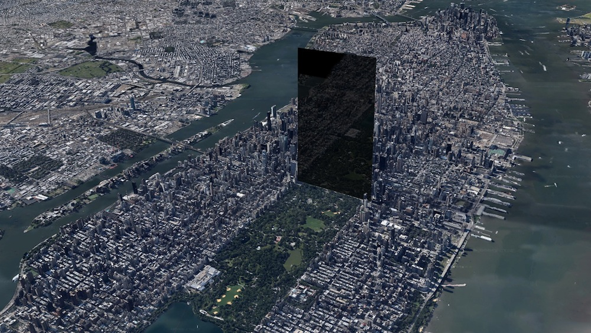

# ONE/MILLION/BILLION DOLLARS

### TLDR
* Due Feb 10 at the start of class  
* Make a visualization showing the difference between $1, $1M, and $1B
* Any media, any format
* Upload project or URL to Canvas
* One paragraph description of your approach

***

### ASSIGNMENT
This week, we'll continue thinking about the ways that we can visually encode numbers. Data visualization is often about explaining topics that are difficult for people to understand. Sometimes this has to do with the complexity of the topic, but often it's just about giving folks a way to understand really big numbers! (COVID infection rates are a great example: is 600k new infections in one day a lot? Is that better than before?)

Over the past few years, there has been a lot of discussion around wealth in America: Jeff Bezos' net worth ([$187 billion](https://www.npr.org/2020/12/10/944620768/theres-rich-and-theres-jeff-bezos-rich-meet-the-members-of-the-100-billion-club)) versus the wage paid to Amazon warehouse workers ([about $15/hour](https://www.glassdoor.com/Hourly-Pay/Amazon-Warehouse-Worker-Hourly-Pay-E6036_D_KO7,23.htm)); during the Covid pandemic, the world's richest people became [$931 billion wealthier](https://www.usatoday.com/story/money/2020/12/01/american-billionaires-that-got-richer-during-covid/43205617); Elon Musk's wealth grew an astonishing [524% between March and December 2020](https://www.visualcapitalist.com/the-rich-got-richer-during-covid-19-heres-how-american-billionaires-performed), a $129 billion increase. But there's a point where these numbers just get too big for us to really understand.

Your assignment is to create a visualization, using any media and format you like, to show the relative difference between one dollar, a million dollars, and a billion dollars. No bar charts or other "traditional" visualizations: think about a visually engaging way of showing these three numbers.)

A good place to start is converting a dollar to another object. For example, in [Tom Scott's video](https://www.youtube.com/watch?v=8YUWDrLazCg) he converts the thickness of a dollar bill into distance:

* One dollar bill is about is \~0.1mm thick
* One million bills stacked up would be about the length of a football field
* One billion bills would be about 67.7 miles

Then think about how you can show (or have us hear, or otherwise make us understand) that difference. In the video, Scott literally goes the distance to make this real for us: he first walks the length of a football field, then gets in his car and drives for over an hour from his home to the ocean. The video goes on and on, no narration just a view out the windshield, but it's that boring duration that makes it so impactful. A simple idea that's really effective.

But distance is just one measure. What about the area of those bills? Converting them to weight? If $1 is a single atom, how large are a billion atoms? Or do the opposite: if $1B buys you a coffee, how much do you get gor $1? Think weird, explore the numbers, and see what interesting ways (video, illustrations, photography, sculpture, collage, music, anything) that you can show the vast differences that a few zeroes can make.

In his chapter *What We Talk About When We Talk About Visualization* (in the `Readings` folder) Alberto Cairo talks about *figurative* vs *non-figurative* visualizations. Figurative visualizations have a visual connection with what they are displaying. A map is figurative because it literally shows the landforms; assembly instructions for IKEA furniture show drawings of the parts. Non-figurative visualizations have no visual connection with the things they represent; a chart is a bunch of shapes and colors. For this project, which form makes the most sense? What is gained and lost by either option?

*Above: an image from Josh Orter (of the Stupid Calculations blog) showing how big a shape would be made by stacking every iPhone screen into a huge grid. This is from 2013, so imagine what it would be like now...*

***

### DELIVERABLES
* Visualization (in any media/format) that shows the difference between $1, $1M, and $1B
* Upload finished piece (or URL, if it's too big or is better that way) to Canvas
* Include 1-paragraph description of your approach to the project as a comment

***

### INSPIRATION
*Some of these examples are in the `Images` folder for this week, others are links*
* Charles and Ray Eames amazing (and entirely analog) film [*Powers of Ten*](https://www.youtube.com/watch?v=0fKBhvDjuy0) from 1977
* Tom Scott's [*A Million Dollars vs a Billion Dollars, Visualized: A Road Trip*](https://www.youtube.com/watch?v=8YUWDrLazCg), which inspired this project
* Humphrey Yang's [*Elon Musk's $195 Net Worth Visualized with Rice*](https://www.youtube.com/watch?v=Y3oQF9F0aO8), which in turn inspired Tom Scott's video
* An uncredited gif showing different causes of death (spoiler: sharks = 5, deer = 130, and snakes = 100,000)
* Josh Orter's (of the amazingly-named but sadly-defunct [Stupid Calculations](http://www.stupidcalculations.com) blog) [*Every iPhone Screen*](http://www.stupidcalculations.com/blog/2013/5/14/stupid-calculation-no-1-monophone)
* [*1/10,000th Scale World*](https://xkcd.com/2411/) by xkcd, featuring giant people walking around the Earth
* A screenshot of a tweet from Paul Franz that converts 1M and 1B into time
* An old but excellent video from Veritasium titled [*How Far Away is the Moon? (The Scale of the Universe)*](https://www.youtube.com/watch?v=Bz9D6xba9Og)

***

### RESOURCES
* If you need to convert one unit to another, you can just type it into Google (or, if you're on a Mac, into Spotlight!). For example, if you search for `0.55mm to inches` it will give you the answer – easy!

